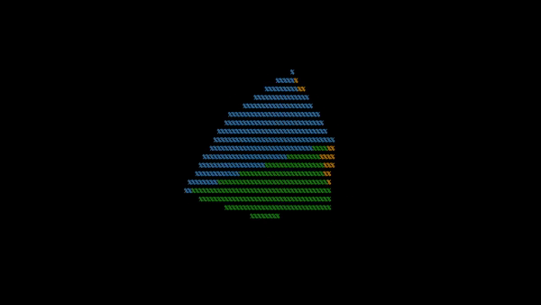

# ncurses-cube

A lightweight curses based 3D spinning ASCII screensaver.



## Installation

### Note
Installation has only been tested on Linux, but it should work on macos
if Clang and Ncurses are installed. WSL recommended for windows.

### 1. Install Dependencies
You need `clang` `make`, and the `ncurses` library headers.

**Ubuntu / Debian:**
```bash
sudo apt update
sudo apt install clang make libncurses-dev
```

**Arch Linux:**
```bash
sudo pacman -S clang make ncurses
```

**Fedora:**
```bash
sudo dnf install clang make ncurses-devel
```

### 2. Build and Install
Once you have the dependencies, run:
```bash
git clone https://github.com/dlopez72/ncurses-cube
cd ncurses-cube
sudo make install
```
Note: This installs the binary to /usr/local/bin/ncurses-cube. Ensure this directory is in your $PATH.

### 3. Uninstalling
To remove the tool from your system, run
```bash
sudo make uninstall
```


## Usage
-------------
    Usage : ncurses-cube [options]
    Visualize a rotating ASCII cube.

    Options:
    	    -c          Use colors if your terminal supports it
    	    -x          Start with only x axis rotation
    	    -y          Start with only y axis rotation
    	    -z          Start with only z axis rotation

## Controls

| Key | Description |
| --- | ----------- |
| <kbd>x</kbd> | Toggle x axis rotation |
| <kbd>y</kbd> | Toggle y axis rotation |
| <kbd>z</kbd> | Toggle z axis rotation |
| <kbd>=</kbd> / <kbd>-</kbd> | Increase/decrease rotation speed |
| <kbd>q</kbd> | Quit ncurses-cube |


